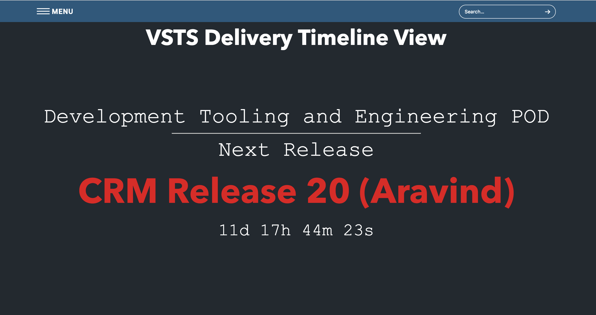

## VSTS  MINI 

A minified version of the Azure DevOps, wherein we can read the workitems/ delivery plans/ Team chart/ Trello view (in design phase)

Workitems - We can read the workitems based on the team and sprint, this also gives a list of cards been worked on in a particular sprint.
delivery plans - The delivery plans will be shown in a countdown fashion based on the data provided in the Azure plan
Team chart - This gives the velocity of the team from last 3 sprints, so it will be helpful to plan the sprint.

# **How to Run / Install**
- Run `make` will help you to see the list of commands to get started.

# **Installation via Docker**

Use the docker hub image

`docker pull parithiban/vsts-mini`

After the image is built or downloaded run

`docker run -p 49160:3000 parithiban/vsts-mini`

Then navigate to  http://localhost:49160/

# Setting up config

Following need to be updated in `src/config.sample.js` :

- VSTS_TOKEN
- ACCOUNT_NAME
- PROJECT
- PLAN_ID
- TEAM_ID
- PROJECT_ID

Ref: https://docs.microsoft.com/en-us/rest/api/vsts/work/plans/list?view=vsts-rest-4.1

Then rename the file to `config.js`

**Count Down**

