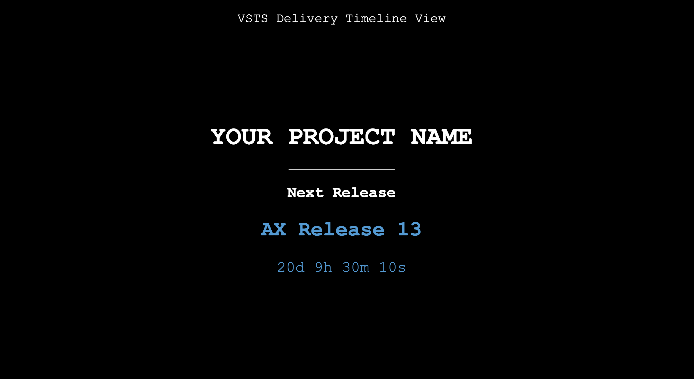

## VSTS  MINI 

A Count down timer screen to show the next release from Visual Studio Team Service Plan
- This will fetch plan details from VSTS plan and pick the next release based on the markers and run a count down for the release.

# **How to Run / Install**
- Run `make` will help you to see the list of commands to get started.

# Setting up config

Following need to be updated in `src/config.sample.js` :

- VSTS_TOKEN
- ACCOUNT_NAME
- PROJECT
- PLAN_ID

Ref: https://docs.microsoft.com/en-us/rest/api/vsts/work/plans/list?view=vsts-rest-4.1

Then rename the file to `config.js`

**Count Down**

